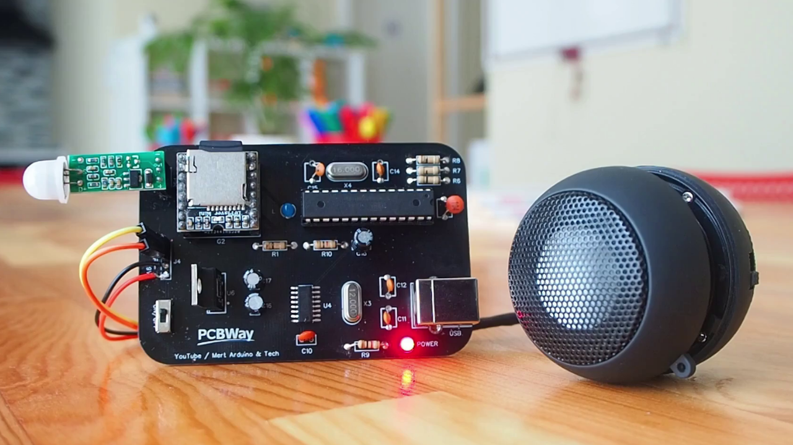

# Make the Talking / Voice Notification Warning System
This project we have made a Talking / Voice Notification and Warning System. At least two sensors can be used in this project. In this project, PIR sensor (The PIR Motion sensor module is an automatic control module based on infrared technology) and IR sensor (IR Infrared Obstacle Avoidance Sensor Module has a pair of infrared transmitting and receiving tubes). The DFPlayer Mini module was used to play audio files. (The DFPlayer Mini MP3 Player For Arduino is a small and low price MP3 module with an simplified output directly to the speaker) We used one 9V battery for power consumption and one mini speaker for audio files. We chose DIP components for the PCB, so it became an easily solderable board. Of course, this project includes one Atmega328P microcontroller and the minimum required component.  
  
